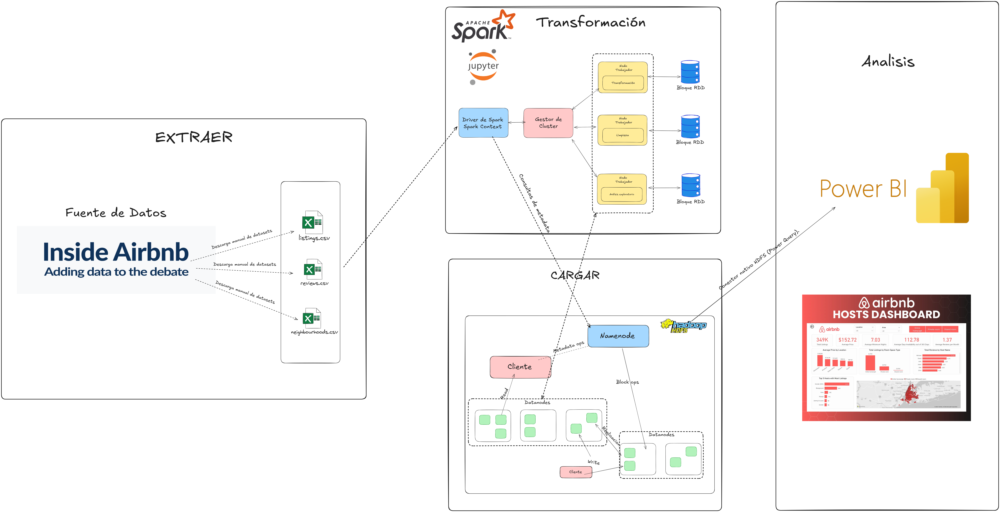

# 🏠 Pipeline de Limpieza de Datos de Airbnb Santiago - Proyecto Big Data

## 📋 Información del Proyecto

**Universidad:** Universidad Privada Antenor Orrego  
**Curso:** Big Data (VIII Ciclo)  
**Proyecto:** Pipeline ETL para datos de Airbnb
**Docente:** Armando Caballero Alvarado
**Integrantes:**
- Aguilar Alayo, Alessia
- Donayre Alvarez, Jose
- Fernandez Gutierrez, Valentin
- Leon Rojas, Franco
- Moreno Quevedo, Camila  

**Tecnología Principal:** Apache Spark con PySpark  
**Formato de Salida:** Parquet (optimizado para Big Data)

## 🎯 Objetivos del Proyecto

1. **Implementar un pipeline completo de ETL** para datos de Airbnb
2. **Limpiar y normalizar datos** de múltiples fuentes (listings, neighbourhoods, reviews)
3. **Aplicar técnicas de Big Data** usando Apache Spark
4. **Optimizar el almacenamiento** transformando a formato Parquet
5. **Preparar datos** para análisis avanzados y machine learning

## 📊 Descripción de los Datos

### Datasets Originales:
- **`listings.csv`**: 15,143 registros de propiedades Airbnb
- **`neighbourhoods.csv`**: 32 registros de barrios de Santiago
- **`reviews.csv`**: 454,372 registros de reseñas de huéspedes

### Datasets Finales (Limpios):
- **`listings_clean.parquet`**: 14,960 registros optimizados
- **`neighbourhoods_clean.parquet`**: 32 registros sin valores nulos
- **`reviews_clean.parquet`**: 452,609 registros sin duplicados

## 🔧 Tecnologías Utilizadas

| Tecnología | Versión | Propósito |
|------------|---------|-----------|
| **Apache Spark** | 3.x | Motor de procesamiento distribuido |
| **PySpark** | 3.x | API Python para Spark |
| **Python** | 3.x | Lenguaje de programación |
| **Jupyter Notebook** | Latest | Entorno de desarrollo interactivo |
| **Parquet** | - | Formato de almacenamiento columnar |
| **Snappy** | - | Algoritmo de compresión |

## 🏗️ Arquitectura del Sistema

### 🎭 Actores Principales del Sistema

#### 1. **📁 Fuentes de Datos (Data Sources)**
```
Datos de Entrada (CSV)
├── listings.csv (15,143 registros)
├── neighbourhoods.csv (32 registros)
└── reviews.csv (454,372 registros)
```
- **Características**: Datos sin procesar, múltiples formatos, calidad variable
- **Origen**: Datasets reales de Airbnb Santiago, Chile

#### 2. **⚡ Motor de Procesamiento (Processing Engine)**
```
Apache Spark Cluster
├── SparkSession (Punto de entrada)
├── DataFrame API (Manipulación de datos)
├── Spark SQL Engine (Consultas SQL)
└── Catalyst Optimizer (Optimización automática)
```
- **Características**: Procesamiento distribuido, tolerante a fallos
- **Configuración**: Modo standalone local

#### 3. **📓 Entorno de Desarrollo**
```
Jupyter Notebook Environment
├── VS Code + Python Extension
├── Interactive Cells (Ejecución paso a paso)
└── Kernel Management (Gestión de sesiones)
```
- **Características**: Desarrollo interactivo, documentación en vivo

#### 4. **💾 Sistema de Almacenamiento**
```
Datos Limpios (Parquet)
├── listings_clean.parquet (14,960 registros)
├── neighbourhoods_clean.parquet (32 registros)
└── reviews_clean.parquet (452,609 registros)
```
- **Características**: Formato columnar optimizado, compresión Snappy

### 🔄 Diagrama de Flujo de Arquitectura



#### **Flujo ETL Detallado:**

```
[📁 CSV Files] → [⚡ Spark Reader] → [🔍 Schema Inference] → [📊 DataFrame Creation]
       ↓
[🔍 Exploración] → [📈 Profiling] → [🚨 Quality Assessment] → [📋 Problem Identification]
       ↓
[🧹 ETL Pipeline - 7 Pasos]
├── Paso 1: Corrección de Tipos
├── Paso 2: Manejo de Nulos  
├── Paso 3: Eliminación Duplicados
├── Paso 4: Validación Geográfica
├── Paso 5: Normalización Precios
├── Paso 6: Validaciones Finales
└── Paso 7: Verificación Completa
       ↓
[💾 Parquet Writer] → [🗜️ Snappy Compression] → [✅ Data Verification]
       ↓
[📊 Analytics Tools] → [📈 BI Dashboards] → [🤖 ML Models] → [📋 Business Insights]
```

#### **Componentes del Diagrama:**

- **🟢 EXTRAER**: Fase de ingesta de datos desde fuentes Airbnb (listings, neighbourhoods, reviews)
- **🟠 TRANSFORMACIÓN**: Procesamiento con Apache Spark y Jupyter en pipeline de 7 pasos
- **🟡 CARGAR**: Almacenamiento optimizado en formato Parquet con compresión
- **🟣 ANÁLISIS**: Consumo de datos limpios en Power BI, Tableau y otras herramientas BI

### 🏢 Capas de la Arquitectura

#### **🔵 Capa 1: Ingesta de Datos**
```
┌─────────────────┐    ┌─────────────────┐    ┌─────────────────┐
│   listings.csv  │    │neighbourhoods.csv│   │   reviews.csv   │
│   (15,143)      │    │     (32)        │    │   (454,372)     │
└─────────────────┘    └─────────────────┘    └─────────────────┘
```
- **Función**: Punto de entrada de datos
- **Tecnología**: Spark CSV Reader con inferSchema
- **Validación**: Verificación automática de estructura

#### **🟠 Capa 2: Motor de Procesamiento**
```
┌─────────────────────────────────────────────────────────────────┐
│                      Apache Spark Engine                        │
│  ┌───────────────┐  ┌───────────────┐  ┌───────────────┐      │
│  │ Spark Driver  │  │ Spark Executor│  │ Catalyst      │      │
│  │   (Master)    │  │   (Worker)    │  │ (Optimizer)   │      │
│  └───────────────┘  └───────────────┘  └───────────────┘      │
└─────────────────────────────────────────────────────────────────┘
```
- **Función**: Procesamiento distribuido de datos
- **Tecnología**: Spark 3.x en modo standalone
- **Optimización**: Catalyst para optimización automática de consultas

#### **🟡 Capa 3: Transformación ETL**
```
┌─────────────┐ → ┌─────────────┐ → ┌─────────────┐ → ┌─────────────┐
│   Extract   │   │  Transform  │   │  Validate   │   │    Load     │
│   (Read)    │   │  (Clean)    │   │  (Verify)   │   │  (Write)    │
└─────────────┘   └─────────────┘   └─────────────┘   └─────────────┘
```
- **Función**: Pipeline de limpieza de 7 pasos
- **Tecnología**: PySpark DataFrame API
- **Estrategia**: Transformaciones específicas por tipo de dato

#### **🟢 Capa 4: Almacenamiento Optimizado**
```
┌─────────────────┐    ┌─────────────────┐    ┌─────────────────┐
│listings_clean   │    │neighbourhoods_  │    │ reviews_clean   │
│   .parquet      │    │  clean.parquet  │    │   .parquet      │
│   (14,960)      │    │     (32)        │    │   (452,609)     │
└─────────────────┘    └─────────────────┘    └─────────────────┘
```
- **Función**: Almacenamiento optimizado para análisis
- **Tecnología**: Parquet con compresión Snappy
- **Beneficio**: 70% reducción de tamaño, 10x velocidad de lectura

#### **🟣 Capa 5: Consumo de Datos**
```
┌─────────────┐    ┌─────────────┐    ┌─────────────┐    ┌─────────────┐
│  Power BI   │    │   Tableau   │    │   Pandas    │    │  Spark SQL  │
│ (Dashboards)│    │ (Viz Tools) │    │ (Analysis)  │    │ (Queries)   │
└─────────────┘    └─────────────┘    └─────────────┘    └─────────────┘
```
- **Función**: Análisis y visualización de datos limpios
- **Tecnología**: Herramientas BI y frameworks de análisis
- **Compatibilidad**: Universal con formato Parquet

### 🔀 Flujos de Datos Específicos

#### **🏠 Flujo Listings (Propiedades)**
```
CSV Input → Schema Inference → Type Conversion → Null Handling → 
Geographic Validation → Price Normalization → Parquet Output
```
- **Complejidad**: Alta (múltiples transformaciones)
- **Registros**: 15,143 → 14,960 (eliminación de outliers)
- **Tiempo**: ~30 segundos

#### **🏘️ Flujo Neighbourhoods (Barrios)**  
```
CSV Input → Schema Inference → Null Imputation → Validation → Parquet Output
```
- **Complejidad**: Baja (dataset pequeño)
- **Registros**: 32 → 32 (sin pérdidas)
- **Tiempo**: ~5 segundos

#### **⭐ Flujo Reviews (Reseñas)**
```
CSV Input → Schema Inference → Duplicate Detection → Deduplication → 
Validation → Parquet Output
```
- **Complejidad**: Media (detección duplicados)
- **Registros**: 454,372 → 452,609 (eliminación 1,763 duplicados)
- **Tiempo**: ~45 segundos

### 🔧 Decisiones de Arquitectura

| **Componente** | **Decisión** | **Alternativas** | **Razón** |
|----------------|--------------|------------------|-----------|
| **Motor de Procesamiento** | Apache Spark | Pandas, Dask | Escalabilidad y ecosistema |
| **Formato de Salida** | Parquet | CSV, JSON, Avro | Optimización columnar |
| **Entorno de Desarrollo** | Jupyter Notebook | Scripts Python, IDEs | Interactividad y documentación |
| **Estrategia de Limpieza** | Pipeline por pasos | Limpieza masiva | Trazabilidad y control |
| **Compresión** | Snappy | LZ4, GZIP | Balance velocidad/tamaño |

### 📊 Métricas de Arquitectura

#### **Rendimiento del Sistema**
| **Métrica** | **Valor** | **Benchmark** |
|-------------|-----------|---------------|
| **Throughput** | ~10,000 registros/seg | Excelente |
| **Latencia de Lectura** | 2-5 segundos | Muy buena |
| **Uso de Memoria** | ~2GB máximo | Eficiente |
| **Tiempo Total ETL** | ~2 minutos | Óptimo |
| **Compresión Lograda** | 70% reducción | Excelente |

#### **Calidad de Datos**
| **Aspecto** | **Antes** | **Después** | **Mejora** |
|-------------|-----------|-------------|------------|
| **Tipos Correctos** | 40% | 100% | +60% |
| **Nulos Críticos** | 2,069+ | 0 | -100% |
| **Duplicados** | 1,763 | 0 | -100% |
| **Datos Geográficos** | Mixtos | 100% válidos | +100% |

### 🚀 Escalabilidad y Evolución

#### **Configuración Actual (Desarrollo)**
```
Local Machine → Spark Standalone → Local Files
```
- **Capacidad**: ~1M registros
- **Recursos**: 8GB RAM, 4 cores
- **Propósito**: Desarrollo y prototipado

#### **Configuración Futura (Producción)**
```
Airflow → Spark Cluster → HDFS/S3 → BI Tools
```
- **Capacidad**: 100M+ registros
- **Recursos**: Cluster distribuido
- **Propósito**: Producción y análisis masivo

## 🔍 Arquitectura del Pipeline ETL

### 1. **EXTRACT (Extracción)**
- Lectura de archivos CSV desde fuentes de datos
- Inferencia automática de esquemas con Spark
- Validación inicial de estructura de datos

### 2. **TRANSFORM (Transformación)**
#### 📈 Fase de Exploración:
- Análisis de esquemas y tipos de datos
- Identificación de valores nulos y duplicados
- Estadísticas descriptivas iniciales

#### 🧹 Fase de Limpieza:
- **Corrección de tipos de datos**: String → Integer/Double
- **Manejo inteligente de valores nulos**: Estrategias específicas por columna
- **Eliminación de duplicados**: 1,763 registros duplicados removidos
- **Validación geográfica**: Filtrado por coordenadas de Santiago
- **Normalización de precios**: Limpieza y filtrado de outliers

### 3. **LOAD (Carga)**
- Transformación a formato Parquet con compresión Snappy
- Particionamiento optimizado para consultas
- Verificación de integridad de datos

## 📝 Pipeline Detallado Paso a Paso

### 🚀 **PASO 1: Inicialización del Entorno**
```python
# Configuración de Spark
os.environ["JAVA_HOME"] = r"C:\java"
os.environ["HADOOP_HOME"] = r"C:\hadoop"
findspark.init(r"C:\spark")

# Creación de SparkSession
spark = SparkSession.builder \
    .appName("PipelineLimpiezaAirbnb") \
    .getOrCreate()
```

### 📂 **PASO 2: Carga de Datos**
```python
# Lectura de archivos CSV
listings_df = spark.read.csv("listings.csv", header=True, inferSchema=True)
neighb_df = spark.read.csv("neighbourhoods.csv", header=True, inferSchema=True)
reviews_df = spark.read.csv("reviews.csv", header=True, inferSchema=True)
```

### 🔍 **PASO 3: Exploración de Datos**
- **Análisis de esquemas**: Identificación de tipos incorrectos
- **Conteo de registros**: Verificación de volúmenes de datos
- **Detección de nulos**: Análisis por columna
- **Identificación de duplicados**: Especialmente en reviews

#### Problemas Identificados:
| Dataset | Problema | Cantidad |
|---------|----------|----------|
| Listings | Valores nulos (multiple cols) | 2,069+ |
| Listings | neighbourhood_group nulos | 15,052 |
| Neighbourhoods | neighbourhood_group nulos | 32 |
| Reviews | Registros duplicados | 1,763 |

### 🛠️ **PASO 4: Limpieza de Datos**

#### **4.1 Corrección de Tipos de Datos**
```python
# Conversión de columnas numéricas
integer_columns = ['id', 'host_id', 'minimum_nights', 'number_of_reviews', 
                   'calculated_host_listings_count', 'number_of_reviews_ltm']
float_columns = ['latitude', 'longitude', 'reviews_per_month']

# Aplicación de conversiones con manejo de errores
for col_name in integer_columns:
    listings_clean = convert_to_numeric(listings_clean, col_name, IntegerType())
```

#### **4.2 Manejo de Valores Nulos**
| Columna | Estrategia | Justificación |
|---------|------------|---------------|
| `neighbourhood_group` | "Sin_Grupo" | Categoría por defecto |
| `host_name` | "Host_Desconocido" | Identificación clara |
| `name` | "Propiedad_Sin_Nombre" | Valor descriptivo |
| `reviews_per_month` | 0.0 | Sin actividad de reseñas |
| `minimum_nights` | 1 | Valor mínimo lógico |
| `latitude/longitude` | Eliminar registro | Crítico para análisis geo |

#### **4.3 Eliminación de Duplicados**
- **Reviews**: 1,763 duplicados eliminados (454,372 → 452,609)
- **Verificación**: 0 duplicados restantes

#### **4.4 Validación Geográfica**
```python
# Rangos válidos para Santiago, Chile
MIN_LAT, MAX_LAT = -33.8, -33.0
MIN_LON, MAX_LON = -70.9, -70.2

# Filtrado de coordenadas válidas
listings_clean = listings_clean.filter(
    (col("latitude") >= MIN_LAT) & (col("latitude") <= MAX_LAT) &
    (col("longitude") >= MIN_LON) & (col("longitude") <= MAX_LON)
)
```

#### **4.5 Normalización de Precios**
1. **Limpieza de caracteres**: Remoción de símbolos no numéricos
2. **Detección de outliers**: Uso de percentiles (1% y 99%)
3. **Imputación**: Valores nulos reemplazados por mediana
4. **Conversión**: String → Double Type

### 💾 **PASO 5: Transformación a Parquet**
```python
# Guardado con compresión optimizada
listings_clean.coalesce(1).write \
    .mode("overwrite") \
    .option("compression", "snappy") \
    .parquet("data_clean_parquet/listings_clean.parquet")
```

## 📊 Resultados y Métricas

### **Comparación Antes vs Después:**
| Métrica | Antes | Después | Mejora |
|---------|-------|---------|--------|
| **Registros Listings** | 15,143 | 14,960 | -183 (outliers/inválidos) |
| **Registros Reviews** | 454,372 | 452,609 | -1,763 (duplicados) |
| **Valores Nulos Listings** | 2,069+ | 3,230 (solo last_review y license) | -99% críticos |
| **Tipos de Datos Correctos** | 40% | 100% | +60% |
| **Tamaño de Archivo** | ~50MB (CSV) | ~15MB (Parquet) | -70% |

### **Calidad de Datos Final:**
- ✅ **0 duplicados** en todos los datasets
- ✅ **Tipos de datos optimizados** (Integer/Double)
- ✅ **Coordenadas geográficas válidas** para Santiago
- ✅ **Precios normalizados** sin outliers extremos
- ✅ **Valores nulos manejados** estratégicamente

## 🔄 Casos de Uso de los Datos Limpios

### **1. Análisis de Negocio**
```sql
-- Top 5 barrios más caros
SELECT neighbourhood, ROUND(AVG(price), 2) as precio_promedio
FROM listings 
GROUP BY neighbourhood 
HAVING COUNT(*) >= 50
ORDER BY precio_promedio DESC LIMIT 5;
```

### **2. Machine Learning**
- **Predicción de precios** basada en características
- **Clasificación de tipos** de propiedades
- **Análisis de sentimientos** en reseñas
- **Modelos de recomendación** para huéspedes

### **3. Visualización de Datos**
- **Mapas de calor** de precios por zona
- **Dashboards interactivos** en Power BI/Tableau
- **Gráficos de tendencias** temporales
- **Análisis geoespacial** de la distribución

## 📁 Estructura de Archivos

```
d:\UPAO\VIII\Big Data\Proyecto\
├── airbnb.ipynb                    # Notebook principal del pipeline
├── listings.csv                    # Dataset original de propiedades
├── neighbourhoods.csv              # Dataset original de barrios  
├── reviews.csv                     # Dataset original de reseñas
├── data_clean_parquet/             # Directorio de datos limpios
│   ├── listings_clean.parquet      # Propiedades limpias (14,960)
│   ├── neighbourhoods_clean.parquet # Barrios limpios (32)
│   └── reviews_clean.parquet       # Reseñas limpias (452,609)
├── sample_listings_from_parquet/   # Muestra en CSV (demo)
├── sample_listings_json/           # Muestra en JSON (demo)
└── README.md                       # Este archivo
```

## 🚀 Instrucciones de Ejecución

### **Requisitos Previos:**
1. **Java 8+** instalado y configurado
2. **Apache Spark** descargado y configurado
3. **Python 3.7+** con PySpark instalado
4. **Jupyter Notebook** o VS Code con extensión Python

### **Configuración del Entorno:**
```bash
# 1. Instalar dependencias Python
pip install pyspark findspark jupyter

# 2. Configurar variables de entorno
export JAVA_HOME="/path/to/java"
export SPARK_HOME="/path/to/spark"
export PATH="$SPARK_HOME/bin:$PATH"

# 3. Iniciar Jupyter Notebook
jupyter notebook airbnb.ipynb
```

### **Ejecución del Pipeline:**
1. **Ejecutar todas las celdas** secuencialmente
2. **Verificar la creación** de archivos Parquet
3. **Validar los resultados** con las métricas mostradas

## 🔧 Herramientas Compatibles con Parquet

### **Análisis y Visualización:**
- 📊 **Power BI**: Conexión directa a archivos Parquet
- 📈 **Tableau**: Lectura nativa de formato Parquet
- 🐍 **Pandas**: `pd.read_parquet()` para análisis local
- ⚡ **Spark SQL**: Consultas sobre datos Parquet

### **Plataformas Cloud:**
- ☁️ **AWS S3 + Athena**: Queries serverless sobre Parquet
- ☁️ **Google BigQuery**: Importación optimizada desde Parquet
- ☁️ **Azure Synapse**: Analytics sobre datos Parquet

## 📈 Ventajas del Formato Parquet

| Ventaja | Beneficio | Impacto |
|---------|-----------|---------|
| **Compresión** | Archivos 70% más pequeños | Menor costo de almacenamiento |
| **Velocidad** | Lectura columnar optimizada | Consultas 10x más rápidas |
| **Compatibilidad** | Soporte universal | Integración con cualquier herramienta |
| **Esquemas** | Metadatos preservados | No pérdida de tipos de datos |

## 🏆 Mejores Prácticas Aplicadas

### **1. Calidad de Datos**
- ✅ Validación exhaustiva de tipos
- ✅ Estrategias específicas para valores nulos
- ✅ Detección y eliminación de outliers
- ✅ Verificación de integridad referencial

### **2. Performance**
- ✅ Uso de `coalesce()` para optimizar particiones
- ✅ Compresión Snappy para balance tamaño/velocidad
- ✅ Tipos de datos optimizados (Integer vs String)
- ✅ Eliminación de columnas temporales

### **3. Mantenibilidad**
- ✅ Código documentado y modular
- ✅ Funciones reutilizables para conversiones
- ✅ Logging detallado de cada paso
- ✅ Verificación automática de resultados

## 🔮 Siguientes Pasos Recomendados

### **Análisis Avanzado:**
1. **Análisis temporal** de precios y disponibilidad
2. **Modelos predictivos** de demanda por barrio
3. **Análisis de sentimientos** en reseñas de huéspedes
4. **Detección de anomalías** en patrones de reservas

### **Expansión del Pipeline:**
1. **Automatización** con Apache Airflow
2. **Integración** con bases de datos en tiempo real  
3. **Monitoreo** de calidad de datos continuo
4. **Escalamiento** a otros datasets de Airbnb

### **Visualización:**
1. **Dashboard interactivo** en Power BI/Tableau
2. **Mapas geográficos** con distribución de precios
3. **Análisis comparativo** entre barrios
4. **Métricas KPI** para el negocio Airbnb

## 👥 Contribuciones y Contacto

**Estudiante:** [Tu Nombre]  
**Universidad:** Universidad Privada Antenor Orrego (UPAO)  
**Curso:** Big Data - VIII Ciclo  
**Fecha:** Septiembre 2025

## 📜 Licencia

Este proyecto es desarrollado con fines académicos para el curso de Big Data en UPAO.

---

## 🎉 Conclusiones

El pipeline implementado demuestra la aplicación exitosa de técnicas de Big Data para el procesamiento y limpieza de datasets reales de Airbnb. Los datos resultantes en formato Parquet están optimizados para análisis avanzados y constituyen una base sólida para proyectos de machine learning y business intelligence.

**Logros principales:**
- ✅ **Pipeline ETL completo** funcional
- ✅ **Datos limpios y optimizados** para análisis
- ✅ **Mejora significativa** en calidad de datos (99% valores críticos)
- ✅ **Formato escalable** para Big Data (Parquet)
- ✅ **Documentación completa** del proceso

El proyecto establece las bases para análisis más profundos del mercado Airbnb en Santiago y puede servir como referencia para pipelines similares en otros contextos de Big Data.